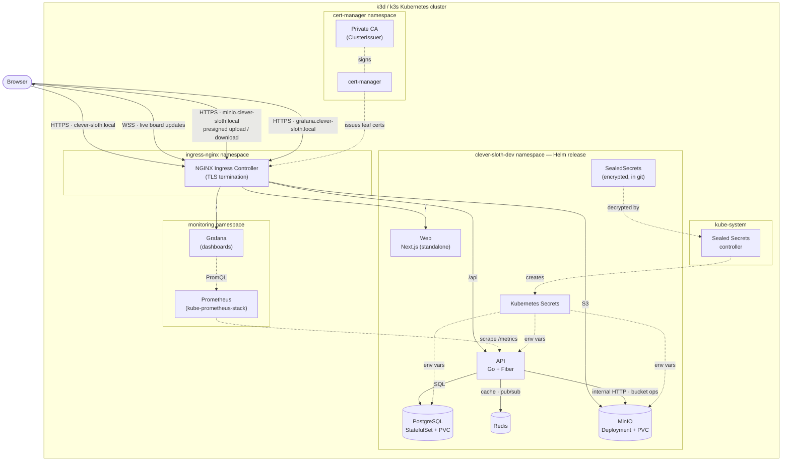
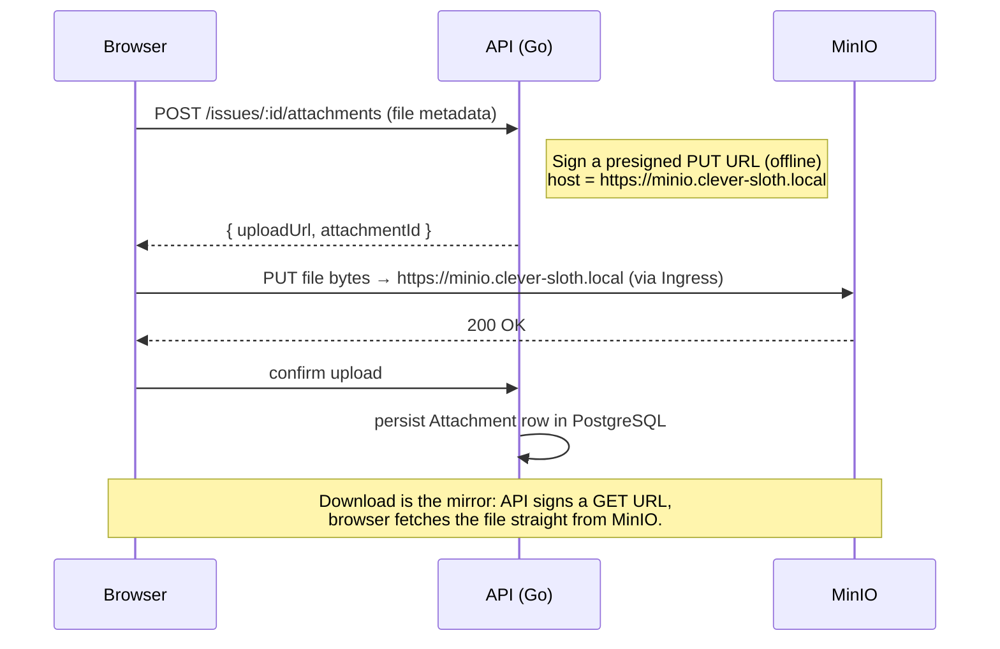

# 🦥 Clever Sloth

**A self-hosted, Jira-style project management platform — built to run the way production systems do.**

> **Created and built by [Nithin Pasula](https://github.com/NithinPasula).**
> Designed, owned, and maintained by Nithin Pasula as a hands-on platform for mastering production-grade Kubernetes and DevOps.

---

## 📖 Overview

Clever Sloth is a full-featured project tracker (a focused, open-source take on Jira) built from scratch. It is **100% free and self-hostable** — every component is open-source, with no paid services.

The application is intentionally engineered as the **workload for a real DevOps journey**: it ships with health/readiness probes, Prometheus metrics, structured logging, graceful shutdown, and 12-factor configuration — so it can be deployed and operated on Kubernetes the way real production systems are.

**Status:** ✅ Application (Phases 1–3) complete · ✅ **Phase 4 — Kubernetes** complete (Helm-packaged, deployed to a local cluster with Ingress, cert-manager TLS, and Sealed Secrets) · 🚧 **Phase 5 — Observability** in progress (Prometheus + Grafana with live API dashboards).

---

## 🏗️ Architecture

Clever Sloth runs as a single Helm release on Kubernetes. A stateless Go API and a Next.js front-end sit behind an NGINX Ingress that terminates TLS; PostgreSQL, Redis, and MinIO provide persistence, cache/pub-sub, and object storage. Secrets are stored in git **encrypted** (Sealed Secrets) and decrypted only inside the cluster. A Prometheus + Grafana stack scrapes the API's metrics and renders live dashboards.



### Attachment flow (presigned URLs)

Files never stream through the API — the browser uploads and downloads **directly** to MinIO using short-lived signed URLs. The API signs those URLs against the **public HTTPS** host (so the browser sees no mixed content), while it performs its own bucket operations over the **internal** network. Keeping bytes out of the API is what makes it cheap to scale horizontally.



---

## ✨ Features

### Project & issue management

- **Workspaces & projects** with role-based access (owner / admin / member / viewer)
- **Issues** with types (Epic, Story, Task, Sub-task, Bug), priorities, and auto-generated keys (`CS-1`, `CS-2`, …)
- **Kanban board** with drag-and-drop across columns and **real-time updates over WebSockets**
- **Backlog** with search, grooming, and assign-to-sprint
- **Sprints** — create, start, and complete (incomplete work returns to the backlog)
- **Dashboard** — analytics by status, priority, and type
- **Rich issue detail** — editable title/description, comments, full **activity/audit log**, and **file attachments**

### Engineering & security

- JWT auth (access + refresh tokens), bcrypt password hashing, httpOnly refresh cookies
- No user enumeration on login; JWT algorithm-confusion protection
- Presigned S3 (MinIO) uploads — files never pass through the API
- Prometheus `/metrics`, `/healthz` (liveness) and `/readyz` (DB-aware readiness)
- Structured JSON logs, graceful shutdown, env-based (12-factor) configuration
- Resilient startup — DB and object-storage connections retry with backoff instead of failing hard

---

## 🧱 Tech stack

| Layer            | Technology                                                          |
| ---------------- | ------------------------------------------------------------------- |
| Frontend         | Next.js 16, React 19, TypeScript, Tailwind CSS v4, dnd-kit, Zustand |
| Backend          | Go, Fiber, GORM                                                     |
| Database         | PostgreSQL 16                                                       |
| Cache / realtime | Redis                                                               |
| Object storage   | MinIO (S3-compatible)                                               |
| Email (dev)      | MailHog                                                             |
| Monorepo         | Turborepo + pnpm                                                    |
| Containers       | Multi-stage Docker (distroless API, standalone Next.js)             |
| Orchestration    | Kubernetes (k3d / k3s), packaged with **Helm**                      |
| Ingress / TLS    | ingress-nginx + cert-manager (private CA)                           |
| Secrets          | Sealed Secrets (encrypted secrets committed to git)                 |
| Observability    | Prometheus + Grafana (kube-prometheus-stack), provisioned dashboards |

---

## 📂 Repository structure

```
clever-sloth/
├── apps/
│   ├── api/                 # Go + Fiber backend
│   │   ├── cmd/server/      # entrypoint
│   │   └── internal/        # config, database, models, handlers, auth, ws, storage, observability
│   └── web/                 # Next.js 16 frontend
│       ├── app/             # routes (auth, projects, board, backlog, sprints, dashboard)
│       ├── components/      # UI primitives + board components
│       └── lib/, store/     # API client, types, auth store
├── packages/                # shared config (eslint, typescript, ui)
├── k8s/
│   ├── charts/clever-sloth/ # Helm chart (web, api, datastores, ingress, ServiceMonitor)
│   ├── monitoring/          # kube-prometheus-stack values + Grafana API dashboard
│   └── dev/                 # raw reference manifests + SealedSecrets + cert-manager bootstrap
├── docker-compose.yml       # local infra: Postgres, Redis, MinIO, MailHog
└── apps/*/Dockerfile        # multi-stage image builds
```

---

## 🚀 Getting started (local)

**Prerequisites:** Docker Desktop, Go 1.25+, Node 22+, pnpm 9+.

```bash
# 1. Start infrastructure (Postgres :5433, Redis, MinIO, MailHog)
docker compose up -d

# 2. Run the API (http://localhost:8080)
cd apps/api
go run ./cmd/server

# 3. Run the web app (http://localhost:3000)
cd apps/web
pnpm install
pnpm dev        # or: pnpm build && pnpm start  (lighter on low-RAM machines)
```

Open http://localhost:3000, sign up, create a project, and start tracking work.

> **Note:** The Postgres container is mapped to host port **5433** to avoid clashing with a local PostgreSQL install on 5432.

---

## ☸️ Deploy to Kubernetes

The whole stack is packaged as a Helm chart at `k8s/charts/clever-sloth`. The example below targets a local [k3d](https://k3d.io) cluster.

**One-time cluster prerequisites** (installed via Helm): `ingress-nginx`, `cert-manager`, and the `sealed-secrets` controller. Then bootstrap the private CA used for TLS:

```bash
kubectl apply -f k8s/dev/tls.yaml          # SelfSigned + CA ClusterIssuers
```

**Build & load images** (k3d uses its own containerd, so images are imported, not pulled):

```bash
docker build -t clever-sloth-api:dev ./apps/api
docker build -f apps/web/Dockerfile \
  --build-arg NEXT_PUBLIC_API_URL=https://clever-sloth.local/api/v1 \
  -t clever-sloth-web:dev .
k3d image import clever-sloth-api:dev clever-sloth-web:dev -c clever-sloth
```

**Secrets — encrypted, in git.** Real values live only in your cluster; the repo holds `SealedSecret`s that only the in-cluster controller can decrypt:

```bash
# seal a Secret (repeat per secret), commit the *-sealed.yaml output, then apply
kubeseal --format yaml -f my-secret.yaml > k8s/dev/secrets/my-secret-sealed.yaml
kubectl apply -f k8s/dev/secrets/   # controller decrypts -> real Secrets
```

**Install the release:**

```bash
helm install clever-sloth k8s/charts/clever-sloth \
  -n clever-sloth-dev --create-namespace
```

Map the hostnames to the cluster in your hosts file (`clever-sloth.local`, `minio.clever-sloth.local` → `127.0.0.1`) and open **https://clever-sloth.local**. The chart parameterizes images, replicas, resources, hostnames, ingress/TLS, and the secrets strategy through `values.yaml`.

### Observability

A Prometheus + Grafana stack (`kube-prometheus-stack`) scrapes the API and renders live dashboards. The values file is tuned to run comfortably on a small local cluster:

```bash
helm repo add prometheus-community https://prometheus-community.github.io/helm-charts
helm upgrade --install monitoring prometheus-community/kube-prometheus-stack \
  -n monitoring --create-namespace \
  -f k8s/monitoring/kube-prometheus-stack.values.yaml

# API metrics dashboard — provisioned from a ConfigMap, auto-loaded by Grafana
kubectl apply -f k8s/monitoring/grafana-dashboard-api.yaml
```

A `ServiceMonitor` shipped with the app chart tells Prometheus to scrape the API's `/metrics`. Grafana is exposed at **https://grafana.clever-sloth.local** (same private-CA TLS as the app); the dashboard graphs request rate, error rate, and p50/p95/p99 latency by route.

---

## 🔌 API overview

Base path: `/api/v1`

- **Auth:** `POST /auth/register`, `/auth/login`, `/auth/refresh`, `/auth/logout`, `GET /auth/me`
- **Workspaces / Projects:** `GET /workspaces`, `POST|GET /workspaces/:id/projects`, `GET|PATCH /projects/:id`, project members
- **Issues:** `POST|GET /projects/:id/issues`, `GET /projects/:id/board`, `GET|PATCH|DELETE /issues/:id`, `/issues/:id/activity`
- **Comments / Attachments:** `/issues/:id/comments`, `/issues/:id/attachments`, `/attachments/:id/download`
- **Sprints:** `POST|GET /projects/:id/sprints`, `/sprints/:id/start`, `/sprints/:id/complete`
- **Realtime:** `GET /projects/:id/board/ws` (WebSocket)
- **Ops:** `/healthz`, `/readyz`, `/metrics`

---

## 🗺️ Roadmap — the DevOps journey

The application is the foundation; these phases turn it into a production-grade, observable, GitOps-managed platform on Kubernetes:

- ✅ **Phase 4 — Kubernetes:** multi-stage Docker images, k3d/k3s cluster, **Helm chart**, Ingress + cert-manager (TLS via a private CA), **Sealed Secrets**
- 🚧 **Phase 5 — Observability (in progress):** Prometheus + Grafana with live API dashboards (request rate, error rate, latency percentiles) wired through the Prometheus Operator; Loki + Promtail log aggregation and Alertmanager alerting next
- 🔭 **Phase 6 — Advanced platform:** ArgoCD (GitOps), Linkerd service mesh (mTLS, canary, tracing), HPA, NetworkPolicies, and a **custom Kubernetes Operator** (`CleverSlothProject` CRD)

---

## 👤 Author

**Nithin Pasula** — creator, architect, and maintainer of Clever Sloth.
GitHub: [@NithinPasula](https://github.com/NithinPasula)

## 📄 License

Released under the MIT License — © Nithin Pasula. See [`LICENSE`](./LICENSE).
